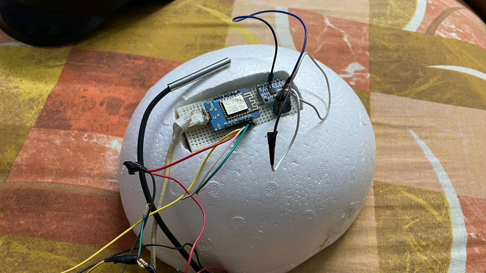
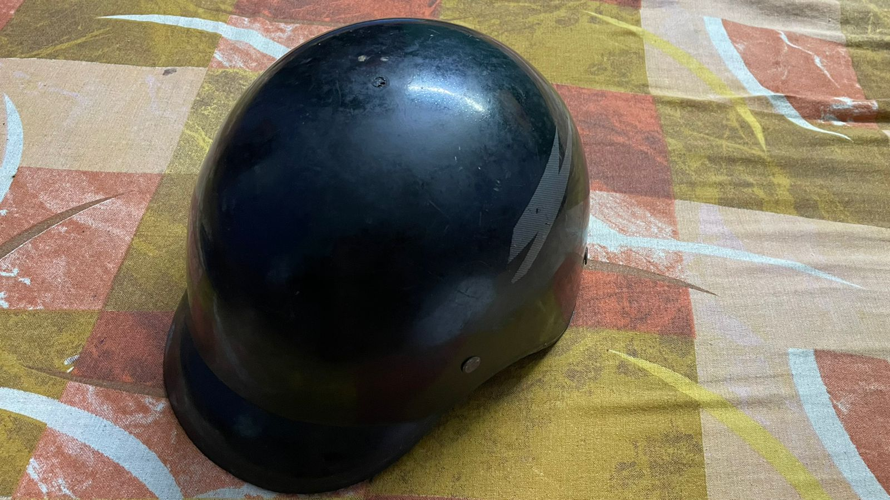

Smart Helmet used to detect the possibility of heat strokes and possibility of Fall in Construction Workers.
## Features

- Heat stroke Detection
- Crash Detection
- Real time alert system
- Easy to use

## 🚀 About Me
I'm a Software Engineer with intrests in IOT projects.

## Screenshots

## Acknowledgements

 - Bergman, M., et al. (2017). Heat stress and heat-related illnesses. American Family Physician, 96(4), 256-262.
 - Heatstroke: Symptoms & causes https://www.mayoclinic.org/diseases-conditions/heat-stroke/symptoms-causes/syc-20353581

